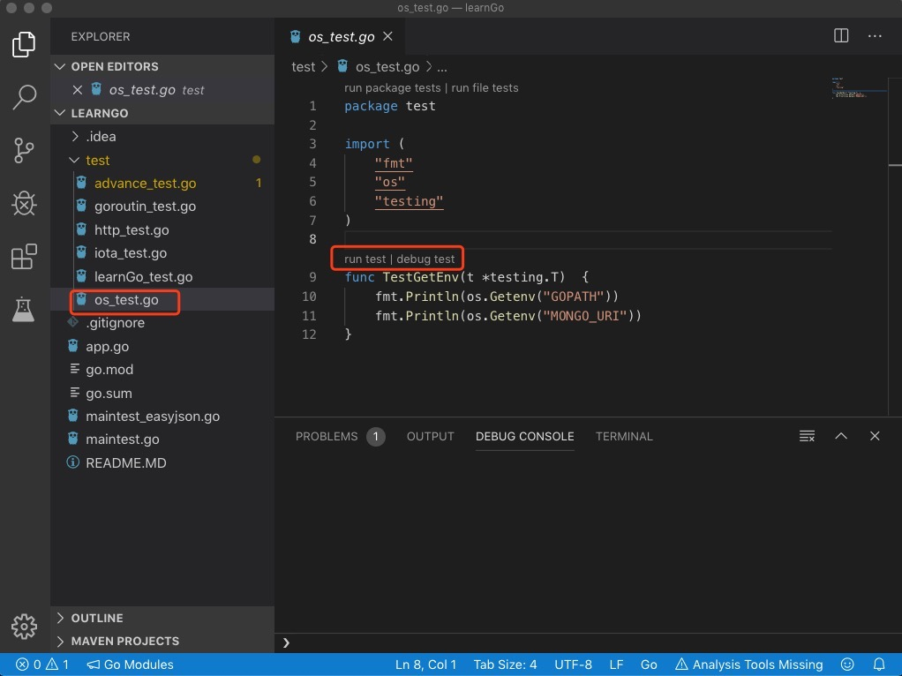

# Learning Golang with Unit Test Sample from zero.
Before playing code to learn you have to setup your development enviroment.

## Install Golang and set up GoPath
```
// install golang
brew install go
vi ~/.bash_profile
// insert your gopath like below:
export GOPATH=$HOME/Documents/GoPath
source ~/.bash_profile
```

## Setup VSCode Golang development enviroment
Install gopls to vscode
```
https://github.com/Microsoft/vscode-go/wiki/Go-modules-support-in-Visual-Studio-Code
```

## Run Unit Test


## Done!
You can easily run unit test and learn code by practise.